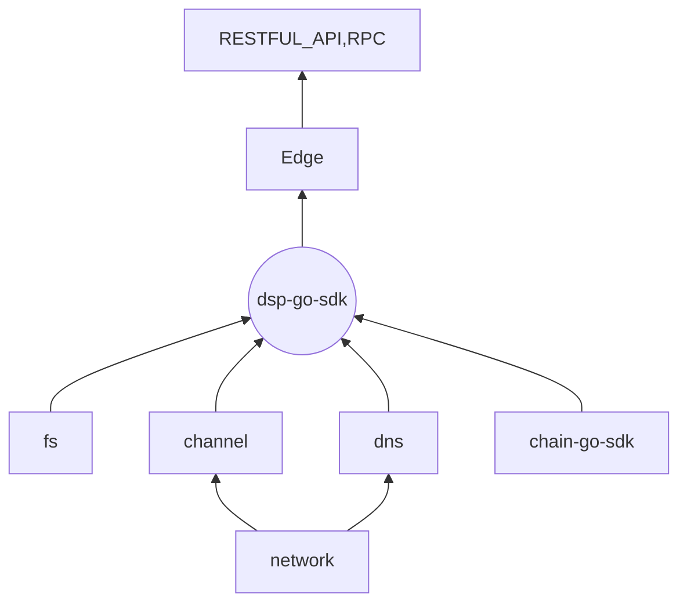

<h1 align="center">edge</h1>


### General

We have developed a underlay infrastructure for distributed storage protocol. Including state channel, file system, blockchain services. We provide following tools for developers：

* dsp-go-sdk
* Edge Client
* Edge REST API Docs


### Architecture




### Quicky start


#### Create a config file

```shell
$ vim config.json
```

Config Example:

```json
{
	"Base": {
		"BaseDir": ".",
		"LogPath": "./SeekLog_Config_1",
		"LogMaxSize": 5242880,
		"ChainId": "1",
		"BlockTime": 5,
		"NetworkId": 1567651915,
		"PublicIP": "",
		"IntranetIP": "",
		"PortBase": 10000,
		"LogLevel": 0,
		"LocalRpcPortOffset": 338,
		"EnableLocalRpc": false,
		"JsonRpcPortOffset": 336,
		"EnableJsonRpc": true,
		"HttpRestPortOffset": 335,
		"HttpCertPath": "",
		"HttpKeyPath": "",
		"RestEnable": true,
        "P2PHttpEnable": true,
		"WsPortOffset": 339,
		"WsCertPath": "",
		"WsKeyPath": "",
		"ChannelPortOffset": 3005,
		"ChannelProtocol": "tcp",
		"DBPath": "./DB",
		"ChainRestAddrs": [
			"http://106.75.10.25:10334",
			"http://106.75.10.25:20334",
			"http://139.219.141.206:20334"
		],
		"ChainRpcAddrs": [
			"http://106.75.10.25:10336",
			"http://106.75.10.25:20336",
			"http://139.219.141.206:20336"
		],
		"NATProxyServerAddrs": "tcp://106.75.9.56:6007",
		"DspProtocol": "tcp",
		"DspPortOffset": 4001,
		"TrackerNetworkId": 1567651915,
		"TrackerProtocol": "tcp",
		"TrackerPortOffset": 337,
		"WalletDir": "./keystore.dat"
	},
	"Fs": {
		"FsRepoRoot": "./FS",
		"FsFileRoot": "./Downloads",
		"FsType": 0,
		"FsGCPeriod": "1h",
		"FsMaxStorage": "",
		"EnableBackup": false
	},
	"Dsp": {
		"BlockConfirm": 1,
		"ChannelClientType": "rpc",
		"ChannelRevealTimeout": "20",
		"ChannelSettleTimeout": "50",
		"BlockDelay": "3",
		"MaxUnpaidPayment": 5,
		"AutoSetupDNSEnable": false,
		"DnsNodeMaxNum": 100,
		"DnsChannelDeposit": 0,
		"DNSWalletAddrs": null,
		"HealthCheckDNS": false,
		"SeedInterval": 600,
		"Trackers": null,
		"MaxUploadTask": 10000,
		"MaxDownloadTask": 10000,
		"MaxShareTask": 10000
	},
	"Bootstraps": []
}
```


#### Run

```shell
$ ./edge --config=config.json 
```

First run will initialize state channel data, please wait a moment. You can use cmd to show the initialization progress.

```shell
$ ./edge channel initprogress
```

The result will be:

```json
{
   "Progress": 0.030025735, // when progress equal to 1, it's finished
   "Start": 108631, // start syncing block height
   "End": 112128,	 // end syncing block height
   "Now": 108736	// current block height
}
```


#### Create wallet

Open another terminal for input commands. Use `account` command for manage account. Create account command is:

```shell
$ ./edge account create --label="123"
```

The shell will prompt you to ether the account password. Then apply the TestNet assets for testing.


#### Create channel

Address `AcJdio7iRMzPxCWgBjSLSqKZcXMjNRtLpd` is a example address for docs. Please use a right dns address.

```shell
$ ./edge channel open --partnerAddr=AcJdio7iRMzPxCWgBjSLSqKZcXMjNRtLpd
```

After create channel, you can deposit assets to it.

```shell
$ ./edge channel deposit --partnerAddr=AcJdio7iRMzPxCWgBjSLSqKZcXMjNRtLpd --amount=100
```

Show all channels commands

```shell
$  ./edge channel list
```


### REST API Doc

See more detail in [Restful API Doc](./docs/REST_API.md)


### Upload & Download


#### Buy space for storing file (optional)

```shell
$./edge userspace set --walletAddr=AZgCJrwXBwSrZVGumnfdUogTUBRUbUq8YW --blockCount=864000 --blockCountOp=1 --size=1024000 --sizeOp=1
```

Result:

```shell
{
   "Tx": "75cdd4b9e30e16e91970fb2243a79807c65d401646732591ffd7c000b83cf3be"
}
```

Use `$ ./edge userspace show --walletAddr=AZgCJrwXBwSrZVGumnfdUogTUBRUbUq8YW`  to show space details.


#### Upload file

```shell
$./edge file upload --filePath=./wallet.dat --desc=wallet.dat --copyNum=0
```

* filePath: the file location.
* fileDesc: description of file, recommend use file name.
* copyNum: number of redundancy storage node


#### Show uploading progress

```shell
$ ./edge file transferlist --transferType=1
```

* transferType: type of transfer list. 0 all files. 1 uploading file. 2 downloading file.

#### Show upload file list

```shell
$ ./edge file uploadlist
```


#### Download file

```shell
$./edge file download --url=save://share/0f53c771
```

* url: the shorten url for file 

#### Show downloading progress

```shell
$./edge file transferlist --transferType=2
```


#### Show all uploaded or downloaded file

```shell
$./edge file transferlist --transferType=0
```


